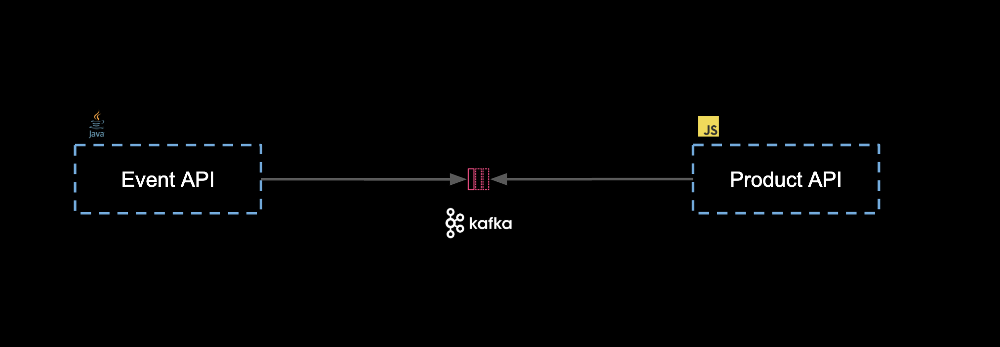

# Example Node Kafka Consumer

 (latest pact)

 (prod/prod pact)

This is an example of a Node kafka consumer that uses Pact, [Pactflow](https://pactflow.io) and GitHub Actions to ensure that it is compatible with the expectations its consumers have of it.

The project uses a Makefile to simulate a very simple build pipeline with two stages - test and deploy.

See the canonical consumer example here: https://github.com/pactflow/example-consumer
See also the full [Pactflow CI/CD Workshop](https://docs.pactflow.io/docs/workshops/ci-cd) for which this can be substituted in as the "consumer".

In the following diagram, we'll be testing the "Product API", a simple HTTP service that exposes product information as a REST API, which is fed events from an Event API on the `product` topic.

## Pre-requisites

**Software**:

https://docs.pactflow.io/docs/workshops/ci-cd/set-up-ci/prerequisites/

## Usage

* Running the API locally: `make start`
* Producing test events into the `product` topic: `make test-events`
* Retrieve latest products: `curl localhost:8080/products`
